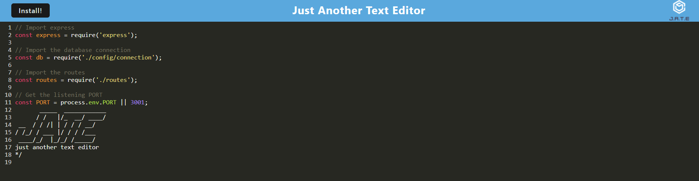

# Text-Editor

## Progressive Web Applications (PWA)

#### **This project is a text editor that runs in the browser. The app is a single-page application that meets the PWA criteria and also function offline.**
**This application is useful to create notes or code snippets with or without an internet connection and retrieve them for later use** 

### Launch the application
```
npm run start
```

### **How to use the application**

* The user can run the text editor application from the terminal and find that JavaScript files have been bundled using webpack.

* Running the webpack plugins creates a generated HTML file, service worker, and a manifest file. 

* The text editor and the IndexedDB creates a database storage.

* The user enters content and subsequently clicks off of the DOM window, the content is saved with IndexedDB.

* When the browswer is reopened after closing it the content in the text editor is retrieved from the IndexedDB.

* The user clicks on the Install button and can download the web application as an icon on the desktop.

### **Preview**

 

💡 **Heroku Live version:**  [click here!](https://salty-cove-60850.herokuapp.com)

